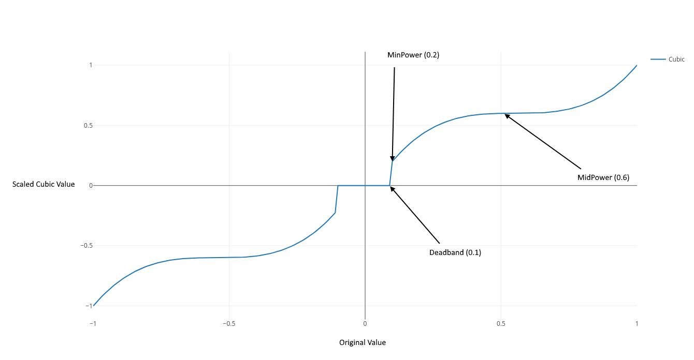

# C++RobotSupport
Team 2655 Helper code for FRC Robots in C++. All code is contained within the team2655 namespace. More specific code will be located in sub-namespaces. To use in a robot project add the team2655 directory to the robot project's src folder

## Joystick Helper Code
**Header:** `team2655/joystick.hpp`

**Namespace:** `team2655::jshelper`

The joystick helper code is a compilation of functions for using WPILib Joystick axes with applied cubic transformations and deadbands. It uses a polynomial fitting routine to generate cubic functions for Joystick axes supporting multiple settings for the generate the function. It also supports simple deadbands without touching the deadband.

Settings:
- deadband: A dead zone on the joystick. The scaled value will always be zero unitl the axis is moved beyond the deadband.
- min power: The minimum amount of power to apply in the scaled value (this will be the value after the deadband threshold is passed)
- mid power: The amount of power that is the "controllable" or middle speed. This is (about) where the "flat" section of the cubic function will be.

NOTE: Deadband only mode (`createDeadbandConfig`) only supports the deadband setting.

###### What it looks like:

## Autonomous Helper Code
**Header:** `team2655/autonomous.hpp`
**Namespace:** `team2655`

The autonomous helper code handles script-based autonomous routines. Scripts are stored on the RoboRIO as CSV files and are made up of commands and arguments. Each row of the CSV file must be a single command. The first column of each row is the command. Following columns are the arguments for the command. 

**Note**: CSV files must be seperated with commas and any spaces before or after commas will be treated as a part of the command or argument.

The helper code consists of three types:
- **AutoManager**: Used to manage script files and progression between commands
- **AutoCommand**: A simple autonomous command with a fixed start and stop point. Only one AutoCommand can run at a time.
- **BackgroundAutoCommand**: An autonomous command that runs along side the current command. Used to control systems while performing other commands.

#### AutoManager
The AutoManager handles scripts and progression of commands. AutoCommands and BackgroundAutoCommands are mapped to strings (command names like in the CSV file) with the AutoManager.

Loading Scripts:
- `loadScript(filePath)`: Loads the given file as a script. This will kill any running command and clear loaded commands.
- `addCommand(cmd, args, pos)`: Adds a command to the set of loaded commands at a given position
- `clearCommands`: Will clear all loaded (and added) commands after killing auto.
- `loadedCommandCount`: Get the number of loaded (and added) commands

Registering Commands:
- `registerCommand(commandCreator, name)`: Register a command with a given name (string). The commandCreator is the buildin `CommandCreator<T>` funciton in the team2655 namespace. Can also pass a list of names (`{"A", "B", "C"}`) to register the command with. T is the AutoCommand class. If T is not a valid AutoCommand there will be an error when *creating* the command (when the command is run from the script).
- `registerBackgroundCommand<T>(name)`: Registers a background command with a given name (can also be a list just like with a normal command). No creator is necessary for background commands. T is the background command class. If T is not a valid BackgroundAutoCommand there will be an error message printed when *registering* the command.
- `unregisterAll`: Unregisters all registered AutoCommands and BackgroundAutoCommands. This will kill running auto and clear loaded commands.

Running Auto:
- `process`: Should be called periodically during autonomous mode. This will handle running the current command's (and each background command's) `process` methods. Returns false if the script is done running (there are no more commands). THIS CAN RETURN FALSE WITH BACKGROUND COMMANDS STILL RUNNING!!!
- `killAuto`: Ends the current command (calling its `complete` method) and all background commands (calling their `kill` methods). Should be called at the begining of teleop to ensure that no more autonomous processes are running.

#### AutoCommand
Auto commands have three methods that must be overriden
- `start(commandName, args)`: Run when the command is started.
- `process`: Run if it is the current command when AutoManager's `process` function is called. This should be the main functionality of the command.
- `handleComplete`: Called when the command is completed (done). This can be triggered by calling `complete` in `process` or `start` or it can be triggered automatically by a timeout (see below). This function should stop all actions for the command.

AutoCommands also support timeouts. Timeouts are usually dependant on arguments so the timeout is usually set in `start`. Timeouts can be set with the `setTimeout(msDuration)` method (time must be in milliseconds). The timeout is always relative to when the command's `start` method is called. When a command times out its `complete` function is called automatically.

**Note**: The timeout is only checked when `process` is called (usually by the AutoManager's process function).

#### BackgroundAutoCommand
BackgroundAutoCommands have four methods that must be overriden
- `updateArgs(commandName, args)`: Called when the command is run in the script. Background commands are always running so there is only one instance of each used by the AutoManager. When a command that is mapped to a background command is present in a script this function is called (similar to a normal AutoCommand's `start` function).
- `process`: Run if `shouldProcess` returns true when the AutoManager's `process` function is called. This should be the main functionality of the command.
- `kill`: Used by the AutoManager to stop the command if needed (eg if `killAuto` is called). This function should stop all actions for the command.
- `shouldProcess`: If this returns true (when the AutoManager calls this function in its `process` method) `process` will be called.

## Example
An updated example in robot code will be added soon. A simulated example is available on [Github](https://github.com/MB3hel/AutoHelperTest)